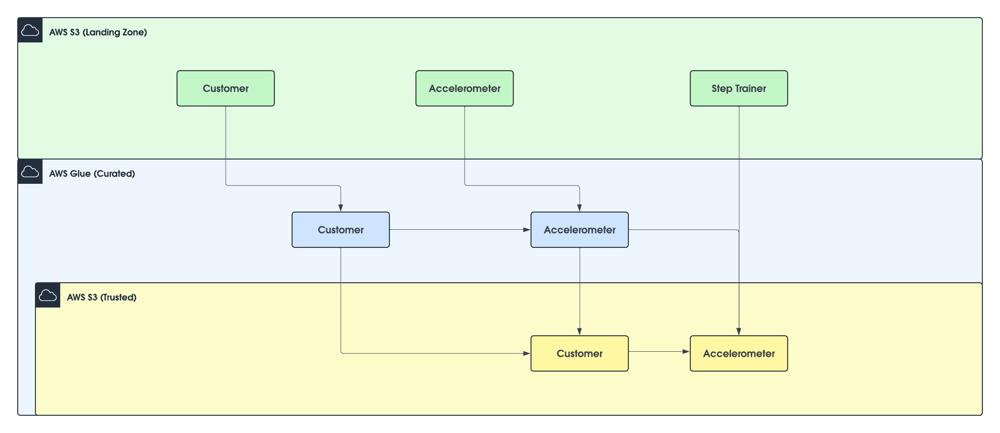
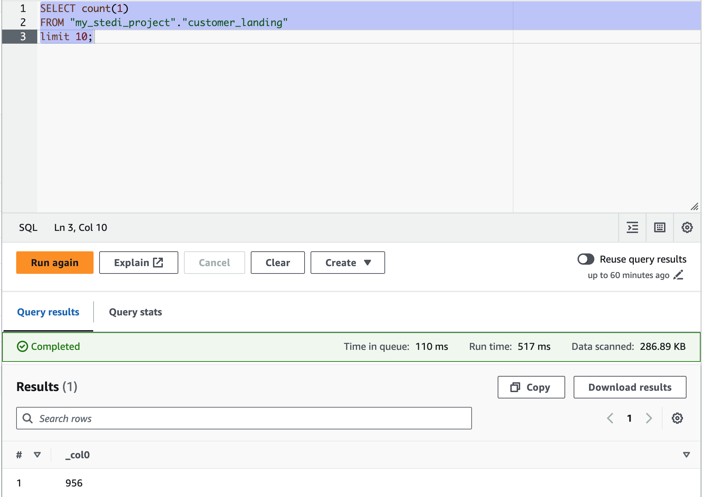
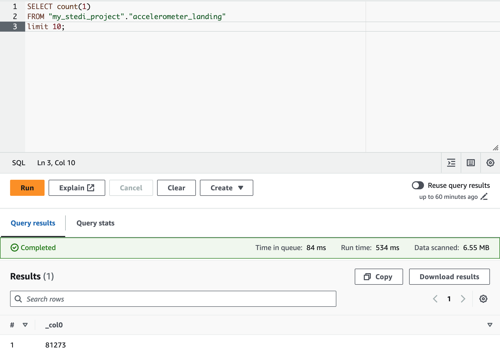
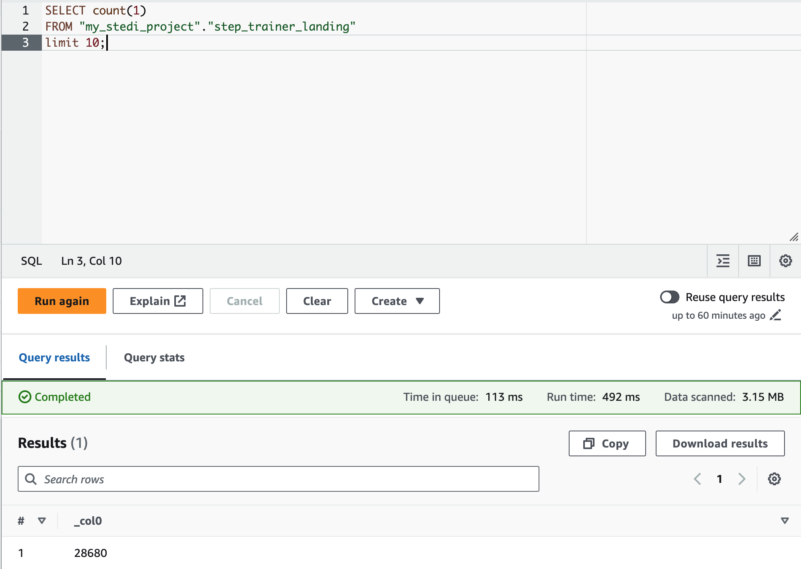
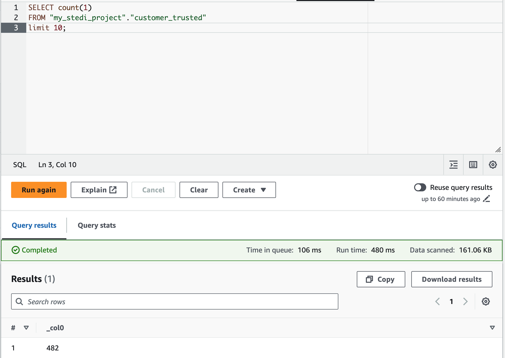
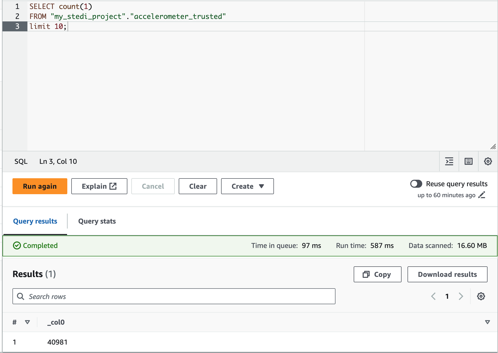
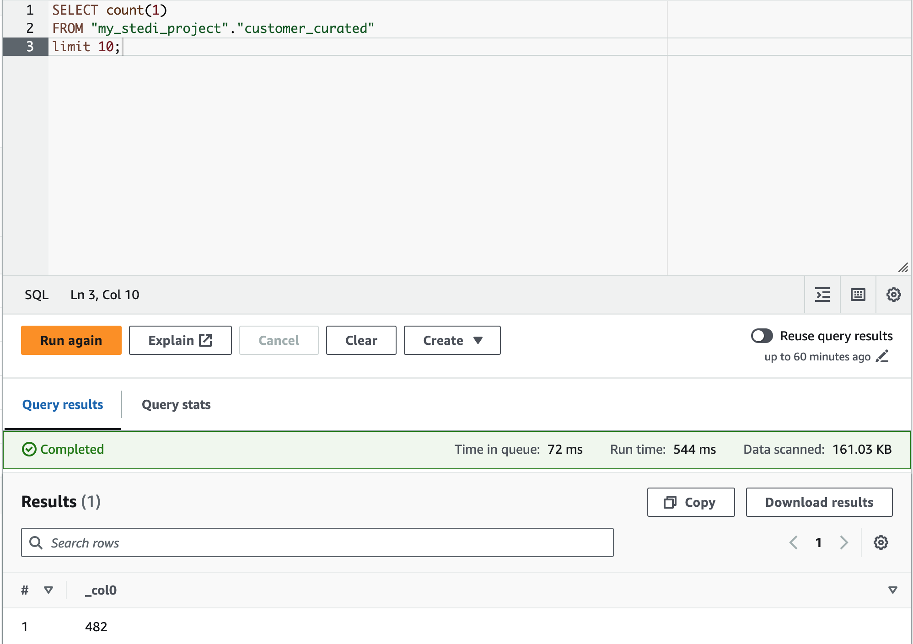
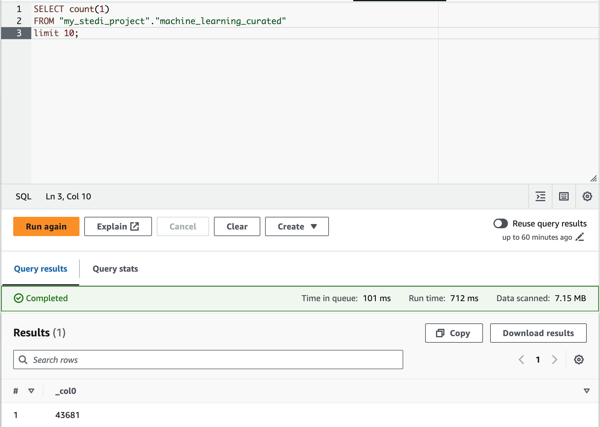

# stedi-human-balance-analytics-lake

<hr>

# Introduction
This project aims to create curated datasets for the data science and analytics teams to analyze the STEDI Human Balance of customers who have consented to share their data. Utilizing AWS technologies, the project establishes a data lake that stores all landing, trusted, and curated information. Additionally, it performs the necessary data transformations to ensure the appropriate data is delivered to the analytics and data science teams.

To work with the STEDI data, you can access three JSON data sources from the Step Trainer available in the following folders on the GitHub repository(within the `data` folder) as well as S3 locations:

- **Customer** - `data/customer/landing` or `s3://my-second-bucket-sgereddy-learnings/customer/landing/`
- **Step Trainer** - `data/step_trainer/landing` or `s3://my-second-bucket-sgereddy-learnings/step_trainer/landing/`
- **Accelerometer** - `data/accelerometer/landing` or `s3://my-second-bucket-sgereddy-learnings/accelerometer/landing/`

These folders contain the respective JSON data files that you can use for analysis and building curated datasets. Here’s a brief overview of each data source:

- **Customer**: 
  - This folder contains JSON files with customer information, including personal details and consent status.
- **Step Trainer**: 
  - This folder includes JSON files with data related to the Step Trainer activities, tracking steps and exercise details.
- **Accelerometer**: 
  - This folder holds JSON files with accelerometer data, providing insights into movement and balance metrics.
      Make sure to explore each folder to understand the structure and content of the data, which will be crucial for your data transformations and analysis tasks.

<hr> 

# Metadata

### Customer
This folder contains JSON files with customer information, including personal details and consent status.

The data from fulfillment and the STEDI website includes the following fields:

- **serialnumber**: Unique identifier for the customer’s device.
- **sharewithpublicasofdate**: Date when the customer agreed to share their data with the public.
- **birthday**: Customer’s date of birth.
- **registrationdate**: Date when the customer registered.
- **sharewithresearchasofdate**: Date when the customer agreed to share their data with researchers.
- **customername**: Name of the customer.
- **email**: Customer’s email address.
- **lastupdatedate**: Date when the customer's information was last updated.
- **phone**: Customer’s phone number.
- **sharewithfriendsasofdate**: Date when the customer agreed to share their data with friends.

These fields provide comprehensive details about the customers, their consent to share data, and their registration and update history.

### Step Trainer 
This folder includes JSON files with data related to the Step Trainer activities, tracking steps and exercise details.

The data from the motion sensor includes the following fields:

- **sensorReadingTime**: Time when the sensor reading was taken.
- **serialNumber**: Unique identifier for the sensor device.
- **distanceFromObject**: Distance measured from the sensor to an object.

These fields capture the essential details about the sensor readings.

### Accelerometer
This folder holds JSON files with accelerometer data, providing insights into movement and balance metrics. Make sure to explore each folder to understand the structure and content of the data, which will be crucial for your data transformations and analysis tasks.

The data includes the following fields:

- **timeStamp**: Time when the data was recorded.
- **user**: Identifier for the user.
- **x**: Accelerometer reading along the x-axis.
- **y**: Accelerometer reading along the y-axis.
- **z**: Accelerometer reading along the z-axis.

These fields capture the essential details about the accelerometer readings from the mobile app.

<hr> 


## Building the Data Lake with AWS Technologies

To build this data lake, and to load, transform, and store the data, the following AWS technologies are used:

### AWS S3 - Storage Layer
AWS S3 serves as the storage layer of the data lake. It is responsible for storing all datasets in different stages:
- **Landing**: Raw data as it is ingested from various sources.
- **Curated**: Data that has been cleaned and enriched for analysis.
- **Trusted**: High-quality data that is reliable and ready for production use.

### AWS Glue - Transform Layer
AWS Glue is utilized as the transform layer of the data lake. It handles several critical tasks:
- **Defining Object Structures**: It automatically crawls the datasets to infer and define the schema of the data.
- **ETL Pipelines**: AWS Glue creates, manages, and executes ETL (Extract, Transform, Load) pipelines that transform raw data into curated and trusted datasets.
- **Data Catalog**: It maintains a centralized metadata repository for easy data discovery and management.

### AWS Athena - Query Layer
AWS Athena is used as the query layer of the data lake. It provides the capability to:
- **Query Datasets**: Perform SQL-based queries directly on the data stored in S3 without the need for complex data warehousing solutions.
- **Analytics**: Conduct complex analytical queries to derive insights from the data.
- **Validations**: Validate the integrity and quality of the datasets to ensure they meet the necessary standards.

These AWS technologies work together to create a robust, scalable, and efficient data lake infrastructure, enabling seamless data ingestion, transformation, storage, and querying for analytics and data science purposes.

<hr> 

## Data Model 
The following data model describes at a high level the sources, data transformations, and the load to final curated datasets. Each highlighted step in this model will be explained in detail in the subsequent sections, including the related code.


<hr>

## Scripts

Here are the explanations for the Python scripts `my_job_stedi_landing_to_trusted.py` and `my_job_stedi_trusted_to_curated.py`:

### Landing to Trusted (`my_job_stedi_landing_to_trusted.py`)
This Python script is responsible for extracting data from the S3 landing zone and performing basic transformations to build trusted datasets. Here's an overview of its functionality:

### Extract Data from S3 Landing Zone:

The script retrieves raw data from the landing zone in AWS S3. This data includes information from various sources such as customer data, motion sensor data, and mobile app data.

```
# Script generated for node extract_customer_landing
extract_customer_landing_node1717846010819 = glueContext.create_dynamic_frame.from_options(
    format_options={"multiline": False}, connection_type="s3", format="json",
    connection_options={"paths": ["s3://my-second-bucket-sgereddy-learnings/customer/landing/"], "recurse": True},
    transformation_ctx="extract_customer_landing_node1717846010819")

# Script generated for node extract_accelerometer_landing
extract_accelerometer_landing_node1717846086317 = glueContext.create_dynamic_frame.from_options(
    format_options={"multiline": False}, connection_type="s3", format="json",
    connection_options={"paths": ["s3://my-second-bucket-sgereddy-learnings/accelerometer/landing/"], "recurse": True},
    transformation_ctx="extract_accelerometer_landing_node1717846086317")
```

#### Basic Transformations:

After the data is extracted from the sources and transformed, an additional step is implemented to filter out customers who have provided consent for research and analysis. This step is crucial for preserving data privacy and maintaining customer trust.


The process involves examining the consent status of each customer, as indicated in the dataset. Customers who have explicitly provided consent for their data to be used for research and analysis purposes are retained in the curated datasets. On the other hand, customers who have not provided such consent are filtered out and excluded from the final datasets.

This filtering mechanism ensures that only data from customers who have consented to research and analysis activities are included in the curated datasets. By adhering to these consent preferences, data privacy is safeguarded, and customer trust is upheld.


```
# Script generated for node transfom_filter_customers
SqlQuery3631 = '''
SELECT * FROM CUSTOMER WHERE SHAREWITHRESEARCHASOFDATE!=0
'''
transfom_filter_customers_node1717844986783 = sparkSqlQuery(glueContext, query=SqlQuery3631, mapping={
    "customer": extract_customer_landing_node1717846010819},
     transformation_ctx="transfom_filter_customers_node1717844986783")

# Script generated for node transform_accelerometer_trusted
SqlQuery3632 = '''
SELECT * FROM ACCELEROMETER INNER JOIN CUSTOMER ON ACCELEROMETER.USER = CUSTOMER.EMAIL
'''
transform_accelerometer_trusted_node1717845272901 = sparkSqlQuery(glueContext, query=SqlQuery3632, mapping={
    "customer": transfom_filter_customers_node1717844986783,
    "accelerometer": extract_accelerometer_landing_node1717846086317},
     transformation_ctx="transform_accelerometer_trusted_node1717845272901")
```

### Build Trusted Datasets:

After the transformations are applied, the script builds trusted datasets. These datasets contain high-quality, reliable data that has undergone initial processing and validation. They serve as the foundation for further analysis and are stored in the trusted zone in AWS S3.

```
# Script generated for node load_customer_trusted
load_customer_trusted_node1717844207005 = glueContext.write_dynamic_frame.from_options(
    frame=transfom_filter_customers_node1717844986783, connection_type="s3", format="json",
    connection_options={"path": "s3://my-second-bucket-sgereddy-learnings/customer/trusted/", "partitionKeys": []},
    transformation_ctx="load_customer_trusted_node1717844207005")

# Script generated for node load_accelerometer_trusted
load_accelerometer_trusted_node1717845486145 = glueContext.write_dynamic_frame.from_options(
    frame=transform_accelerometer_trusted_node1717845272901, connection_type="s3", format="json",
    connection_options={"path": "s3://my-second-bucket-sgereddy-learnings/accelerometer/trusted/", "partitionKeys": []},
    transformation_ctx="load_accelerometer_trusted_node1717845486145")
```

### Trusted to Curated (`my_job_stedi_trusted_to_curated.py`)

This Python script is responsible for extracting data from the S3 trusted zone and performing additional transformations to build curated datasets. Here's an overview of its functionality:

#### Extract Data from S3 Trusted Zone:

The script retrieves trusted datasets from the trusted zone in AWS S3. These datasets contain pre-processed and validated data from various sources.

```
# Script generated for node extarct_accelerometer_trusted
extarct_accelerometer_trusted_node1717846506001 = glueContext.create_dynamic_frame.from_options(
    format_options={"multiline": False}, connection_type="s3", format="json",
    connection_options={"paths": ["s3://my-second-bucket-sgereddy-learnings/accelerometer/trusted/"], "recurse": True},
    transformation_ctx="extarct_accelerometer_trusted_node1717846506001")

# Script generated for node extarct_customer_trusted
extarct_customer_trusted_node1717846432619 = glueContext.create_dynamic_frame.from_options(
    format_options={"multiline": False}, connection_type="s3", format="json",
    connection_options={"paths": ["s3://my-second-bucket-sgereddy-learnings/customer/trusted/"], "recurse": True},
    transformation_ctx="extarct_customer_trusted_node1717846432619")

# Script generated for node extract_step_trainer_landing
extract_step_trainer_landing_node1717847607065 = glueContext.create_dynamic_frame.from_options(
    format_options={"multiline": False}, connection_type="s3", format="json",
    connection_options={"paths": ["s3://my-second-bucket-sgereddy-learnings/step_trainer/landing/"], "recurse": True},
    transformation_ctx="extract_step_trainer_landing_node1717847607065")
```

#### Additional Transformations:

Once the trusted datasets are extracted, additional transformations are applied to further enrich the data and prepare it for analysis.

```
# Script generated for node SQL Query
SqlQuery3467 = '''
WITH DISTINT_CUST AS (
SELECT DISTINCT USER FROM ACCELEROMETER
)
SELECT CUSTOMER.* FROM CUSTOMER INNER JOIN DISTINT_CUST ON CUSTOMER.EMAIL = DISTINT_CUST.USER
'''
SQLQuery_node1717846575501 = sparkSqlQuery(glueContext, query=SqlQuery3467,
                                           mapping={"customer": extarct_customer_trusted_node1717846432619,
                                                    "accelerometer": extarct_accelerometer_trusted_node1717846506001},
                                           transformation_ctx="SQLQuery_node1717846575501")

# Script generated for node transform_step_trainer_trusted
SqlQuery3466 = '''
SELECT STEP.* FROM STEP INNER JOIN CUSTOMER ON STEP.SERIALNUMBER = CUSTOMER.SERIALNUMBER
'''
transform_step_trainer_trusted_node1717847596198 = sparkSqlQuery(glueContext, query=SqlQuery3466, mapping={
    "step": extract_step_trainer_landing_node1717847607065, "customer": SQLQuery_node1717846575501},
                                                                 transformation_ctx="transform_step_trainer_trusted_node1717847596198")

# Script generated for node transform_machine_learning_curated
SqlQuery3468 = '''
SELECT STEP.SENSORREADINGTIME, STEP.SERIALNUMBER, STEP.DISTANCEFROMOBJECT,ACCELEROMETER.USER,ACCELEROMETER.X,ACCELEROMETER.Y,ACCELEROMETER.Z FROM STEP INNER JOIN ACCELEROMETER ON STEP.SENSORREADINGTIME = ACCELEROMETER.TIMESTAMP
'''
transform_machine_learning_curated_node1717847904124 = sparkSqlQuery(glueContext, query=SqlQuery3468, mapping={
    "accelerometer": extarct_accelerometer_trusted_node1717846506001,
    "step": transform_step_trainer_trusted_node1717847596198},
     transformation_ctx="transform_machine_learning_curated_node1717847904124")
```

#### Build Curated Datasets:

Sanitize Customer data (Trusted Zone) to include only customers with accelerometer data and research consent.
Create a Glue Table (Curated Zone) named "customers_curated" with sanitized customer data.

Create an aggregated table named "machine_learning_curated" containing Step Trainer Readings and associated accelerometer data for customers with research consent.

```
# Script generated for node Amazon S3
AmazonS3_node1717847000844 = glueContext.getSink(path="s3://my-second-bucket-sgereddy-learnings/customer/curated/",
                                                 connection_type="s3", updateBehavior="UPDATE_IN_DATABASE",
                                                 partitionKeys=[], enableUpdateCatalog=True,
                                                 transformation_ctx="AmazonS3_node1717847000844")
AmazonS3_node1717847000844.setCatalogInfo(catalogDatabase="my_stedi_project", catalogTableName="customer_curated")
AmazonS3_node1717847000844.setFormat("json")
AmazonS3_node1717847000844.writeFrame(SQLQuery_node1717846575501)
# Script generated for node lado_step_trainer_trsuted
lado_step_trainer_trsuted_node1717847756005 = glueContext.write_dynamic_frame.from_options(
    frame=transform_step_trainer_trusted_node1717847596198, connection_type="s3", format="json",
    connection_options={"path": "s3://my-second-bucket-sgereddy-learnings/step_trainer/trusted/", "partitionKeys": []},
    transformation_ctx="lado_step_trainer_trsuted_node1717847756005")

# Script generated for node load_machine_learning_trsuted
load_machine_learning_trsuted_node1717848131716 = glueContext.getSink(
    path="s3://my-second-bucket-sgereddy-learnings/machine_learning/trusted/", connection_type="s3",
    updateBehavior="UPDATE_IN_DATABASE", partitionKeys=[], enableUpdateCatalog=True,
    transformation_ctx="load_machine_learning_trsuted_node1717848131716")
load_machine_learning_trsuted_node1717848131716.setCatalogInfo(catalogDatabase="my_stedi_project",
                                                               catalogTableName="machine_learning_curated")
load_machine_learning_trsuted_node1717848131716.setFormat("json")
load_machine_learning_trsuted_node1717848131716.writeFrame(transform_machine_learning_curated_node1717847904124)
job.commit()
```

<hr> 

## Data Validations

### Landing
- **Customer: 956**
```
SELECT count(1)
FROM "my_stedi_project"."customer_landing"
limit 10;

```



- **Accelerometer: 81273**
```
SELECT count(1)
FROM "my_stedi_project"."accelerometer_landing"
limit 10;
```



- **Step Trainer: 28680**

```
SELECT count(1)
FROM "my_stedi_project"."step_trainer_landing"
limit 10;
```


### Trusted
**- Customer: 482**

```
SELECT count(1)
FROM "my_stedi_project"."customer_trusted"
limit 10;
```


**- Accelerometer: 40981**

```SELECT count(1)
FROM "my_stedi_project"."accelerometer_trusted"
limit 10;
```


### Curated
- Customer: 482

```SELECT count(1)
FROM "my_stedi_project"."customer_curated"
limit 10;
```


- Machine Learning: 43681

```SELECT count(1)
FROM "my_stedi_project"."machine_learning_curated"
limit 10;
```

